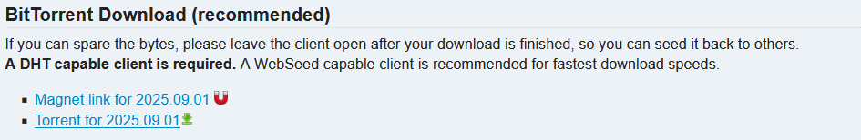

# Linux Virtualization: Easy Guide for Absolute Beginners

Welcome! This guide is for **complete beginners** who want to explore Linux without risking their main system. I'm writing this because, when I first got curious about Linux, I made the mistake of installing it directly on my machine without understanding what I was doing — and I broke things.

If you're curious like I was, **virtual machines** are your safe sandbox. With a VM, you can:
- Experiment freely
- Break things without consequences
- Learn by doing
- Be impulsive, irresponsible, and curious — safely!

Everyone starts somewhere. I hope this helps you get going.

---

## 🚀 What You’ll Need

### ✅ Virtualization Software
This tutorial uses **VirtualBox**, but **VMware** or any hypervisor you're comfortable with will work.

- [Download VirtualBox](https://www.oracle.com/virtualization/technologies/vm/downloads/virtualbox-downloads.html)
- [Download VMware Workstation Player or Fusion](https://www.vmware.com/products/desktop-hypervisor/workstation-and-fusion)

### ✅ ISO Files
We’ll install the following Linux distributions inside virtual machines:
- [Arch Linux](https://archlinux.org/download/)
- [Debian](https://www.debian.org/distrib/)
- [Kali Linux](https://www.kali.org/get-kali/)

You can browse more ISOs here:  
🔗 [https://www.linuxlookup.com/linux_iso](https://www.linuxlookup.com/linux_iso)

---
## 🌀 Arch Linux via Torrent

Arch is minimalist and gives you full control, but it’s not beginner-friendly. That’s okay — we're here to experiment!

- Head to [Arch’s download page](https://archlinux.org/download/)
- Download the **torrent file** (helps the community by seeding!)

  
If you need a torrent client, I recommend [qBittorrent](https://www.qbittorrent.org/download) — it's free, open-source, and not ad-ridden like BitTorrent.

> ✅ **Tip:** Don’t confuse qBittorrent with the original BitTorrent client. They are different!

---

## 🛡️ Kali Linux for Virtual Machines

Kali provides pre-built ISOs specifically optimized for VMs.

- Go to [Kali’s virtual machine downloads](https://www.kali.org/get-kali/#kali-virtual-machines)
- Choose **VirtualBox**, **VMware**, or another option depending on your hypervisor

---

## Debian lightweight

Debian has several options but I went with the lightweight version. I have good internet and as long as you are not offline you should choose this one too.

- Go to [Debian's downloads page](https://www.debian.org/distrib/)
- Choose Debian small image

This is confusing or exciting as you may want to actually think about your computers architecture now. If you click on this 
it will take you here: https://www.debian.org/CD/netinst/ for the option of extra reading if you are curious. 
However you should most likely be ok selecting [amd64](screenshots/debian_amd64)

## 🧠 Too be continued...
